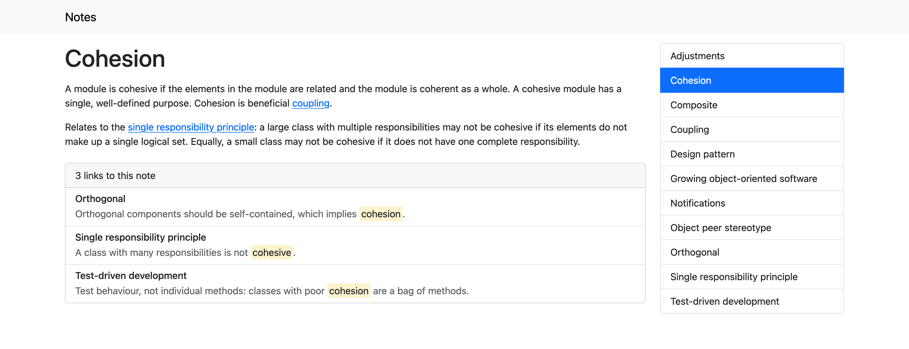
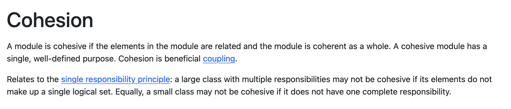
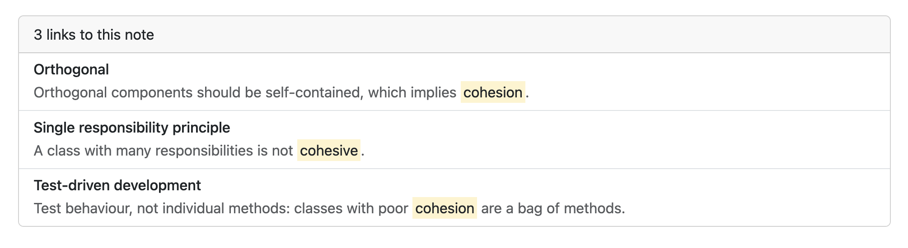

# Vita 🌱

Vita is a tool for [digital gardening](https://maggieappleton.com/garden-history): creating, tending and publishing a collection of notes and ideas.

Vita takes a folder of plain text files and links them together to form a ~~graph~~ garden of knowledge. Vita takes influence from note-taking software like [Obsidian](https://obsidian.md/) and [Roam Research](https://roamresearch.com/).

An example note shown using Vita:



## Installation

Vita requires [Ruby 3.3.0](https://www.ruby-lang.org/en/news/2023/12/25/ruby-3-3-0-released/).

To install:

```
$ gem install vita
```

## Usage

In a folder containing text files, run `vita` to view your notes in a web browser:

```
$ vita
       _ _
__   _(_) |_ __ _
\ \ / / | __/ _` |
 \ V /| | || (_| |
  \_/ |_|\__\__,_|

Starting Vita at http://localhost:9000
```

To publish:

```
$ vita publish
```

Vita creates a `publish` folder containing HTML files for publishing to a web server.

## Links between notes

Vita looks for connections between notes.

When a note's content includes the title of another note, Vita creates a link between the two notes.

Links are clickable. Wherever a note's title appears in another note's content, clicking on it navigates to that note:



Each note lists the other notes that link to it, along with an excerpt from the source note. Clicking on any of these navigates to the source note:



## Home note

If a note titled Home exists, it is treated as a home page and shown when you open your notes. Other notes cannot link to the Home note.

## File format

Vita uses plain text files. You can create them using any text editor and save them with any file extension. You can optionally use Markdown or [Org-mode](https://orgmode.org/) syntax (`.org` files only) to add formatting to your notes.

## Name

Vita is named for Vita Sackville-West, a twentieth-century author and garden designer and creator of [Sissinghurst Castle Garden](https://www.nationaltrust.org.uk/visit/kent/sissinghurst-castle-garden), a favourite place of mine.
